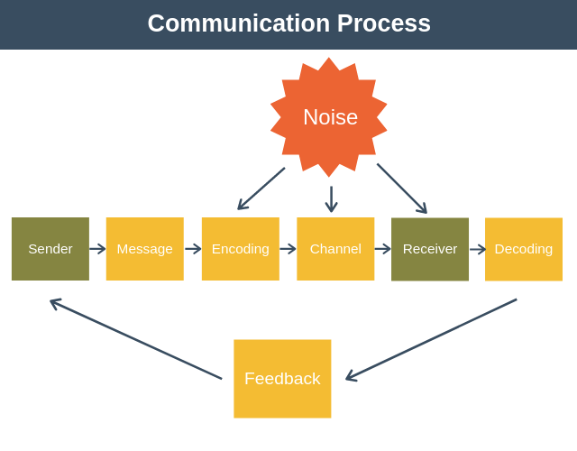

# Computer Networking

A computer network is set of nodes connected by communication links.
A node can be a computer, printer or any end device or intermediate device.
A communication link is a wired or wireless link which carries the information

Computer network is useful for resource sharing.

## Characteristics of network:

-   Fault Tolerance
-   Scalability
-   Quality of service

## Protocols

A protocol is a set of rules governing the data transfer between two mediums.

### Data Flows

-   **Simplex**: Data flow is unidirectional
-   **Half Duplex**: Data flow is bidirectional, but can only happen in one direction at one time
-   **Full Duplex**: Data flow is bidirectional, and can send both ways.

Any communication will have 3 things: sender, reciever, channel.

Protocol determines: what how when is sent through the network

### Protocol elements:

-   Message encoding
-   Message formatting and encpsulation
-   Message timing
-   Message size
-   Message delievery options

## Message encoding

## Message formatting and encpsulation
Encapsulate the data to identify sender and reciever

# OSI Model

