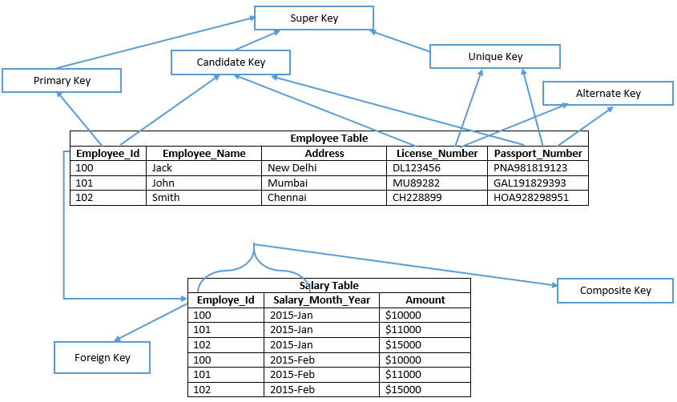

# DBMS

**Data**: Any fact that could be recorded. For e.g.) text, images, numbers, media etc.

**Database**: Collection of related data.

## File system vs DBMS

### File system

The file system is basically a way of arranging the files in a storage medium like a hard disk. The file system organizes the files and helps in the retrieval of files when they are required. File systems consist of different files which are grouped into directories. The directories further contain other folders and files. The file system performs basic operations like management, file naming, giving access rules, etc.

### DBMS system

Database Management System is basically software that manages the collection of related data. It is used for storing data and retrieving the data effectively when it is needed. It also provides proper security measures for protecting the data from unauthorized access. In Database Management System the data can be fetched by SQL queries and relational algebra. It also provides mechanisms for data recovery and data backup.

-   Query Processing
-   Attributes
-   Concurrency
-   Security
-   Data Redundancy
-   Data consistency
-   Data independence
-   Integrity Constraints

## Models in DB

-   **High Level / Conecptual Level**: The layout of the database as shown to the users. For e.g.) ER Model
-   **Representational Level / Implementation**: The relational model i.e.) the tables
-   Low Level / Physical Data Model

# ER Model

-   **Entity**: Any object/thing is called an entity.
-   **Attributes**: Properties of an entity.
-   **Relationships**: A relationship is verb maintaining any relationship among entities.

| Title         | Def         | Exmaples  |
| ------------- | ----------- | --------- |
| Entity        | Thing       | Person    |
| Attributes    | Properties  | Name, Age |
| Relationships | Association | Works for |

**Entity type**: Schema (The layout of any entity).

For e.g.) PERSON(name, age, address): ("Akshat", 20, UP-IN)

The first is the extension of a schema while the last one is intension of it.

## Attrtibutes

-   Simple Attrbiutes
-   **Composite Attrbiutes**: Attributes that can further be divided intp sub-attributes, like name: fname, mname, lname
-   **Single Values Attributes**: Address, Ph.No. etc.
-   **Multi Values Attributes**: age
-   **Stored Attributes**: DOB
-   **Derived Attributes**: age

# Key

A key is used to uniquely identify any tuple in a table.

-   **Candidate Key**: The minimal set of attributes that can uniquely identify a tuple is known as a candidate key.
-   **Super Key**: The set of attributes that can uniquely identify a tuple is known as Super Key.
-   **Primary Key**: There can be more than one candidate key in relation out of which one can be chosen as the primary key.
-   **Alternate Key**: The candidate key other than the primary key is called an alternate key.
-   **Foreign key**: If an attribute can only take the values which are present as values of some other attribute, it will be a foreign key to the attribute to which it refers.



# SQL

SQL(Structured Query Language) is based in relational algebra. It was designed by IBM.

### Create a table

```sql
CREATE TABLE employee (
    emp_id int,
    name varchar(10) NOT NULL,
    bday DATE,
    super int,
    PRIMARY KEY (emp_id),
    FOREIGN KEY (super) REFERENCES employee(super)
);
```

## Referential Integrity

**Referential Trigger Actions:**

```sql
ON DELETE CASCADE
SET NULL
SET DEFAULT
```

## Simple SQL Queries

```sql
SELECT name
FROM emp
WHERE location="Delhi";
```

# Normalization

Database normalization is the process of organizing the attributes of the database to reduce or eliminate data redundancy (having the same data but at different places)

## Anomalies

-   Insertion
-   Deletion
-   Updation

## Functional Dependency

Functional Dependency is a constraint between two sets of attributes in relation to a database.

**A→B**: A determines B. B is functionally dependent on A. Given the value of A, we can determine value of B.

### Types of Functional Dependencies

In, X→Y

-   **Trivial**: AB→A. Deriving nothing new. i.e.) where Y is subset of X.
-   **Non Trivial**: A→B, A→BC. Deriving new. i.e.) where X ∩ Y = ∅.
-   **Semi Trivial**: AB→BC. Deriving something new. i.e.) where X ∩ Y ≠ ∅.

## Closure Set

The set of all the attributes one can determine by a given a set of attributes and functional dependency(ies) is called the closure set of that attribute.

If the closure set of an attrbute contains all the attributes of the relation, it is called the candidate key of the relation.

**Note**: THe superset of a candidate key becomes a super key and hence cannot be counted as a candidate key.

**No. of Candidate Keys**: Given n attributes in a relation, the no.of candidate keys = `2^n - 1`

## Inference Rules

-   **Reflexivity:** If X⊇Y, then X→Y
-   **Augmentation:** If X→Y, then XZ→YZ
-   **Transitive:** If X→Y and Y→Z, then X→Z

## Lossy and Lossless decomposition

**Lossless Decomposition:** Lossless join decomposition is a decomposition of a relation R into relations R1, R2 such that if we perform a natural join of relation R1 and R2, it will return the original relation R

### Difference between lossless and lossy decomposition

| Lossless                                                                                                                                | Lossy                                                                                                                                                                       |
| --------------------------------------------------------------------------------------------------------------------------------------- | --------------------------------------------------------------------------------------------------------------------------------------------------------------------------- |
| The decompositions R1, R2, R2…Rn for a relation schema R are said to be Lossless if there natural join results the original relation R. | The decompositions R1, R2, R2…Rn for a relation schema R are said to be Lossy if there natural join results into addition of extraneous tuples with the original relation R |
| There is no loss of information as the relation obtained after natural join of decompositions is equivalent to original relation.       | There is loss of information as extraneous tuples are added into the relation after natural join of decompositions.                                                         |
| The common attribute of the sub relations is a superkey of any one of the relation.                                                     | The common attribute of the sub relation is not a superkey of any of the sub relation.                                                                                      |
