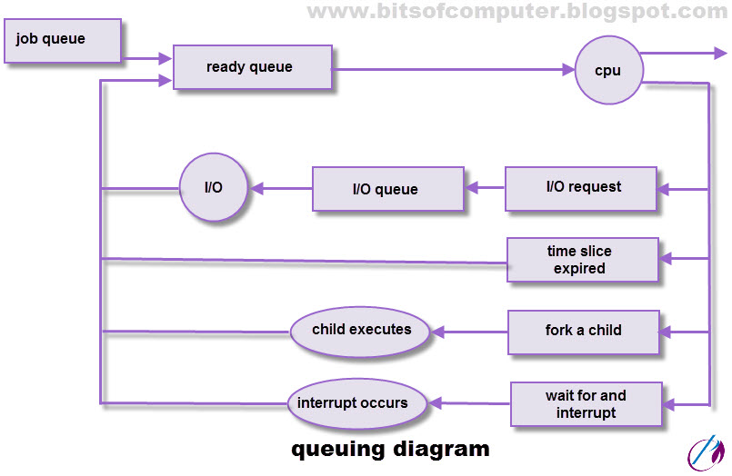

# Notes

## Introduction

Operating system is the interface between user and the hardware.

-   It acts as the resource (CPU, memory) allocator for the processes.
-   It acts as the manager for memory, processes, files, security etc.

## Goals

-   Primary goal: convienience
-   Secondary goal: efficiency

## Types of OS

-   **Batch OS**: There is only 1 computer, different jobs will take inputs from different users and they can wait for the result until the computer is done with them.

    In batch OS, when a process is taking some time at the I/O, CPU can't take another job until then. Hence, the throughput is very low in that.

    Here startvation will happen. The CPU will be idle and hence the throughput is very low in that.

-   **Multiprogramming OS**: It is an extension to the Batch OS. When a job wants to go the I/O, the CPU will proceed to the next job. The CPU will be busy all the time and hence the throughput would better.

-   **Multitasking OS**: Here the CPU can work on multiple jobs without completing any one job completely.

-   **Multiprocessing OS**: Here there are multiple CPUs so many jobs can be handled at once. Here the reliability is also saved. If one CPU fails, others can handle the job.

-   **Realtime OS**: Here every job has a deadline.

## Process

-   Requirements: CPU, I/O

### Attributes of a process

1. **Process ID**: Unique id of any process
2. **Program Counter**: Counter of the process in order of execution
3. Process State
4. **Priority**: Every process is assigned its priority according and by the OS.
5. **General Purpose registers**: Registers assigned to a particular process should be stored at some point of time just in case a preemption occurs.
6. **List of open files and devices**: Whichever process opens or closses the file, a list should be kept.
7. **Protection**: Security for what files are allowed to be accessed by the user.

## States of process

1. **New** (_sm_): Whenever a process is present in secondary memory and is about to be created in the primary process.
1. **Ready** (_mm_): Whenever a process is created, it is ready to run in the main memory.
1. **Run** (_mm_): The process that is being run in the CPU currently, it is in running state
1. **Block or wait** (_mm_): If a process needs the I/O, it is put in the waiting state until then.
1. **Termination/Completion**: Killing the process once it is completed.
1. **Suspend ready** (_sm_): If there are many process on the CPU and a high priority process arrives, the current process are put into suspend state.
1. **Suspend wait** (_sm_): In the above condition, the former processes will wait for the CPU.

## Preemption

When a process still isn't completed but needs more time to complete. The CPU is assigned to some other process, the former process completes the rest of work until then.

If that can't be allowed to break in between, it is said to be not able to preempted.

## Operation on processes

1. Creation
2. Scheduling
3. Executing
4. Killing

## Process Management

## Scheduling Queues

## Parameters of process

-   **Arrival Time**: Time at which the process arrives in the ready queue.

-   **Completion Time**: Time at which process completes its execution.

-   **Burst Time**: Time required by a process for CPU execution.
-   **Turn Around Time**: Time Difference between completion time and arrival time.
    `Turn Around Time = Completion Time – Arrival Time`

-   **Waiting Time**: Time Difference between turn around time and burst time.
    `Waiting Time = Turn Around Time – Burst Time`

# CPU Scheduling

Picking the process from the ready queue and giving it to the CPU.

-   Who: Short term scheduler
-   Where: Ready state to running state
-   When: When a process moves from
    -   Run -> Termination
    -   Run -> Wait
    -   Run -> Ready
    -   New -> Ready i.e.) when a process of high priority is just created.
    -   Wait -> Ready i.e.) when a process of high priority is just came out of waiting queue.

# Scheduling ALgorithms

## FCFS: first come first serve

Process which arruved first will be executed first.
Processes will be sorted in order of their arrival time.

For e.g.)
| P.No. | AT | BT | CT | TAT | WT |
| ----- | -- | -- | -- | --- | -- |
| 1 | 0 | 4 | 4 | 4 | 0 |
| 2 | 1 | 4 | 4 | 4 | 0 |
| 3 | 2 | 1 | 8 | 6 | 5 |
| 4 | 3 | 2 | 10 | 7 | 5 |
